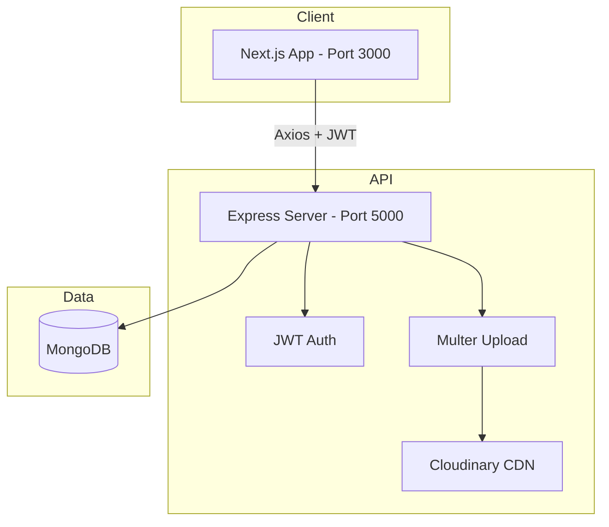

# ShopVerse V2 — Complete Project Guide

This document explains **every source file** in the ShopVerse V2 e-commerce project: a **Next.js** frontend and an **Express + MongoDB** REST API.

---

## Table of Contents

1. [Architecture Overview](#architecture-overview)
2. [Root Files](#root-files)
3. [Backend](#backend)
4. [Frontend](#frontend)
5. [Request Flow Examples](#request-flow-examples)
6. [Environment Variables](#environment-variables)
7. [How to Run](#how-to-run)

---

## Architecture Overview



| Layer | Technology | Role |
|-------|------------|------|
| Frontend | Next.js 16, React 19, TypeScript | UI, routing, client state |
| HTTP client | Axios | Calls REST API with Bearer token |
| Backend | Express 4 | REST API, validation, security |
| Database | MongoDB + Mongoose | Schemas, relations, queries |
| Auth | JWT + bcrypt | Login, protected routes |
| Images | Multer + Cloudinary | Product image upload |
| Styling | Tailwind CSS 4 | Responsive UI + dark mode |

---

## Root Files

### `README.md`

Project overview: features, tech stack, installation steps, API table, Postman instructions.

### `PROJECT_GUIDE.md`

This file — full file-by-file documentation.

### `ShopVerse-V2.postman_collection.json`

Postman/Thunder Client collection with all API endpoints. Variables:

- `baseUrl` → `http://localhost:5000/api`
- `token` → auto-set after **Login**
- `productId`, `categoryId`, `orderId` → set manually from responses

### `requirements-extracted.txt` *(optional)*

Text export of course requirements (if present). Not used at runtime.

---

## Backend

Location: `backend/`

### `package.json`

Defines dependencies and scripts:

```json
{
  "scripts": {
    "start": "node src/app.js",
    "dev": "nodemon src/app.js",
    "seed": "node seed.js"
  }
}
```

Key packages: `express`, `mongoose`, `jsonwebtoken`, `bcrypt`, `multer`, `cloudinary`, `express-validator`, `helmet`, `express-rate-limit`, `express-mongo-sanitize`.

---

### `seed.js`

Populates the database for development:

1. Creates/updates **admin user** (`admin@shopverse.com` / `admin123` by default).
2. Deletes existing products and categories.
3. Inserts 5 categories and 50 sample products with Unsplash images.

```javascript
let admin = await User.findOne({ email: adminEmail });
if (admin) {
  admin.password = adminPassword;
  admin.role = 'admin';
  await admin.save();
} else {
  admin = await User.create({ name: 'ShopVerse Admin', email: adminEmail, password: adminPassword, role: 'admin' });
}
```

Run: `npm run seed` from `backend/`.

---

### `.env.example`

Template for environment variables (copy to `.env`):

- `PORT`, `MONGODB_URI`, `JWT_SECRET`, `JWT_EXPIRE`
- `CLOUDINARY_*` for image hosting
- `FRONTEND_URL` for CORS and password-reset links
- `ADMIN_EMAIL`, `ADMIN_PASSWORD` for seed

---

### `.gitignore`

Excludes `node_modules`, `.env`, logs, etc.

---

## Backend — `src/`

### `src/app.js` — Application entry point

Bootstraps Express: security middleware, routes, error handlers, server listen.

```javascript
app.use(helmet());
app.use(cors({ origin: process.env.FRONTEND_URL || 'http://localhost:3000', credentials: true }));
app.use(mongoSanitize());
app.use(express.json());

const authLimiter = rateLimit({
  windowMs: 15 * 60 * 1000,
  max: 30,
  message: { success: false, message: 'Too many attempts. Please try again later.' },
});

app.use('/api/auth', authLimiter, require('./routes/authRoutes'));
app.use('/api/users', require('./routes/userRoutes'));
app.use('/api/categories', require('./routes/categoryRoutes'));
app.use('/api/products', require('./routes/productRoutes'));
app.use('/api/orders', require('./routes/orderRoutes'));

app.use(notFound);
app.use(errorHandler);
```

---

### `src/config/db.js`

Connects to MongoDB using `MONGODB_URI`:

```javascript
const connectDB = async () => {
  const conn = await mongoose.connect(process.env.MONGODB_URI);
  console.log(`MongoDB Connected: ${conn.connection.host}`);
};
```

---

## Models (`src/models/`)

Mongoose schemas define document shape and validation.

### `User.js`

Stores account data. Password is hashed on save with bcrypt.

```javascript
password: {
  type: String,
  required: true,
  minlength: 6,
  select: false, // never returned in queries by default
},
role: {
  type: String,
  enum: ['user', 'admin'],
  default: 'user',
},
resetPasswordToken: String,
resetPasswordExpire: Date,
```

`userSchema.pre('save')` hashes password when modified. `matchPassword()` compares login input with hash.

---

### `Product.js`

Product catalog item. References `Category` and optional `User` (`createdBy`).

```javascript
category: {
  type: mongoose.Schema.ObjectId,
  ref: 'Category',
  required: true,
},
image: { type: String, required: true }, // Cloudinary URL
```

Text index on `title` and `description` supports search.

---

### `Category.js`

Product category with auto-generated `slug` from `name`:

```javascript
categorySchema.pre('save', function (next) {
  if (this.isModified('name')) {
    this.slug = this.name.toLowerCase().replace(/[^a-z0-9]+/g, '-').replace(/(^-|-$)+/g, '');
  }
  next();
});
```

---

### `Order.js`

Customer order with embedded line items:

```javascript
products: [{
  product: { type: ObjectId, ref: 'Product', required: true },
  quantity: { type: Number, required: true, min: 1 },
  price: { type: Number, required: true },
}],
status: {
  type: String,
  enum: ['pending', 'processing', 'shipped', 'delivered', 'cancelled'],
  default: 'pending',
},
```

---

## Controllers (`src/controllers/`)

Business logic for each resource. Controllers read `req` / `res`, call models, return JSON.

### `authController.js`

| Function | Route | Description |
|----------|-------|-------------|
| `register` | POST `/auth/register` | Create user, return JWT |
| `login` | POST `/auth/login` | Validate credentials, return JWT |
| `getProfile` | GET `/auth/profile` | Current user (protected) |
| `updateProfile` | PUT `/auth/profile` | Update name/email/password |
| `forgotPassword` | POST `/auth/forgot-password` | Create reset token (SHA-256 stored) |
| `resetPassword` | PUT `/auth/reset-password/:token` | Set new password |

Login example:

```javascript
const user = await User.findOne({ email }).select('+password');
const isMatch = await user.matchPassword(password);
if (!isMatch) {
  return res.status(401).json({ success: false, message: 'Invalid credentials' });
}
res.json({ success: true, data: { ...user, token: generateToken(user._id) } });
```

Forgot password stores **hashed** token only; raw token sent in dev via `resetUrl` or console.

---

### `productController.js`

| Function | Route | Access |
|----------|-------|--------|
| `getProducts` | GET `/products` | Public — filters, sort, pagination |
| `getProductById` | GET `/products/:id` | Public |
| `createProduct` | POST `/products` | Admin — multipart image → Cloudinary |
| `updateProduct` | PUT `/products/:id` | Admin — optional new image |
| `deleteProduct` | DELETE `/products/:id` | Admin |

Filtering example:

```javascript
if (search) {
  query.title = { $regex: search, $options: 'i' };
}
if (req.query.price?.gte) query.price.$gte = Number(req.query.price.gte);
// sort, skip, limit for pagination
```

---

### `categoryController.js`

CRUD for categories: `getCategories`, `createCategory`, `updateCategory`, `deleteCategory`. Duplicate names return 400.

---

### `orderController.js`

| Function | Route | Access |
|----------|-------|--------|
| `createOrder` | POST `/orders` | Logged-in user |
| `getMyOrders` | GET `/orders/my-orders` | Logged-in user |
| `getOrders` | GET `/orders` | Admin — all orders |
| `updateOrderStatus` | PATCH `/orders/:id/status` | Admin |

---

### `userController.js`

| Function | Route | Access |
|----------|-------|--------|
| `getUsers` | GET `/users` | Admin — list users without passwords |

```javascript
const users = await User.find({})
  .select('-password -resetPasswordToken -resetPasswordExpire')
  .sort('-createdAt');
```

---

## Routes (`src/routes/`)

Thin routers map HTTP methods to controllers + middleware.

### `authRoutes.js`

```javascript
router.post('/register', registerValidation, register);
router.post('/login', loginValidation, login);
router.post('/forgot-password', forgotPasswordValidation, forgotPassword);
router.put('/reset-password/:token', resetPasswordValidation, resetPassword);
router.get('/profile', protect, getProfile);
router.put('/profile', protect, updateProfile);
```

### `productRoutes.js`

```javascript
router.route('/')
  .get(getProducts)
  .post(protect, adminOnly, upload.single('image'), productValidation, createProduct);

router.route('/:id')
  .get(getProductById)
  .put(protect, adminOnly, upload.single('image'), productUpdateValidation, updateProduct)
  .delete(protect, adminOnly, deleteProduct);
```

### `categoryRoutes.js`, `orderRoutes.js`, `userRoutes.js`

Same pattern: public GET where allowed; `protect` + `adminOnly` for admin mutations.

---

## Middleware (`src/middleware/`)

### `authMiddleware.js` — `protect`

Reads `Authorization: Bearer <token>`, verifies JWT, attaches `req.user`.

```javascript
const decoded = jwt.verify(token, process.env.JWT_SECRET);
req.user = await User.findById(decoded.id).select('-password');
```

### `adminMiddleware.js` — `adminOnly`

```javascript
if (req.user && req.user.role === 'admin') {
  next();
} else {
  res.status(403).json({ success: false, message: 'Not authorized as an admin' });
}
```

### `uploadMiddleware.js`

Multer configured for **memory storage** (buffer passed to Cloudinary):

```javascript
const storage = multer.memoryStorage();
const upload = multer({ storage, limits: { fileSize: 5 * 1024 * 1024 } });
```

### `errorHandler.js`

Central error handler: CastError → 404, ValidationError → 400, duplicate key → 400.

---

## Validations (`src/validations/`)

### `authValidation.js`

Uses `express-validator` for register, login, forgot password, reset password. Returns 400 with field errors.

### `productValidation.js`

- `productValidation` — required fields on **create** (POST).
- `productUpdateValidation` — optional fields on **update** (PUT).

```javascript
body('price').optional().isFloat({ min: 0.01 }).withMessage('Price must be a positive number'),
```

---

## Utils (`src/utils/`)

### `generateToken.js`

Creates JWT signed with `JWT_SECRET`:

```javascript
return jwt.sign({ id }, process.env.JWT_SECRET, {
  expiresIn: process.env.JWT_EXPIRE || '30d',
});
```

### `cloudinary.js`

Configures Cloudinary SDK from env vars for image uploads.

### `resetToken.js`

```javascript
const hashResetToken = (token) =>
  crypto.createHash('sha256').update(token).digest('hex');

const generateResetToken = () => crypto.randomBytes(32).toString('hex');
```

---

## Frontend

Location: `frontend/`

### `package.json`

Scripts: `dev`, `build`, `start`, `lint`. Dependencies: `next`, `react`, `axios`, `lucide-react`, `next-themes`, `react-hot-toast`.

### `next.config.ts` / `next.config.mjs`

Next.js configuration (image domains, etc.).

### `tsconfig.json`

TypeScript paths: `@/*` → `src/*`.

### `postcss.config.mjs` / `eslint.config.mjs`

Tailwind/PostCSS and ESLint setup.

---

## Frontend — `src/lib/`

### `api.ts`

Axios instance for all API calls:

```typescript
const api = axios.create({
  baseURL: process.env.NEXT_PUBLIC_API_URL || 'http://localhost:5000/api',
});

api.interceptors.request.use((config) => {
  const token = localStorage.getItem('token');
  if (token) {
    config.headers.Authorization = `Bearer ${token}`;
  }
  return config;
});
```

### `utils.ts`

Helper `formatPrice(amount)` for currency display.

---

## Frontend — `src/context/`

### `AuthContext.tsx`

Global auth state: `user`, `token`, `isAuthenticated`, `isAdmin`. Persists to `localStorage` on login.

```typescript
const login = (userData: User, authToken: string) => {
  setUser(userData);
  setToken(authToken);
  localStorage.setItem('user', JSON.stringify(userData));
  localStorage.setItem('token', authToken);
};
```

Hook: `useAuth()`.

### `CartContext.tsx`

Shopping cart in `localStorage`. Methods: `addToCart`, `removeFromCart`, `updateQuantity`, `clearCart`. Computes `totalItems` and `totalPrice`.

```typescript
export interface CartItem {
  product: string;
  title: string;
  price: number;
  image: string;
  quantity: number;
  stock: number;
}
```

Hook: `useCart()`.

---

## Frontend — `src/components/`

### `Navbar.tsx`

Top navigation: logo, search (live product search API), cart icon, user menu, admin link, theme toggle, login/logout.

### `CartDrawer.tsx`

Slide-out cart UI. Checkout builds order payload and calls `POST /orders`, then clears cart.

### `ProductCard.tsx`

Card for product grid: image, title, price, link to detail page.

### `FilterSidebar.tsx`

Client component: category radio, price range form, sort dropdown. Updates URL query params → server refetches products.

### `ProtectedRoute.tsx`

Guards pages requiring login or admin:

```typescript
if (!isAuthenticated) {
  router.push(`/login?redirect=${pathname}`);
} else if (adminOnly && !isAdmin) {
  router.push('/');
}
```

### `ThemeProvider.tsx`

Wraps `next-themes` for light/dark/system mode.

### `FloatingTechBackground.tsx` / `InteractiveNodesBackground.tsx`

Decorative animated backgrounds for marketing pages.

---

## Frontend — `src/app/`

Next.js **App Router**: folders = routes. `(auth)` and `(shop)` are route groups (not in URL).

### `layout.tsx` — Root layout

Wraps entire app with providers and global UI:

```tsx
<ThemeProvider>
  <AuthProvider>
    <CartProvider>
      <Navbar />
      <CartDrawer />
      <main>{children}</main>
    </CartProvider>
  </AuthProvider>
</ThemeProvider>
```

### `globals.css`

Tailwind imports and global CSS variables.

### `page.tsx` — Home `/`

Landing page: hero, features, CTA to `/products`.

---

### Auth routes — `(auth)/`

| File | URL | Purpose |
|------|-----|---------|
| `login/page.tsx` | `/login` | Email/password → `POST /auth/login` |
| `register/page.tsx` | `/register` | Sign up |
| `forgot-password/page.tsx` | `/forgot-password` | Request reset link |
| `reset-password/page.tsx` | `/reset-password?token=` | New password form |

Login flow:

```typescript
const res = await api.post("/auth/login", { email, password });
login(res.data.data, res.data.data.token);
router.push(redirect);
```

---

### Shop routes — `(shop)/`

| File | URL | Purpose |
|------|-----|---------|
| `products/page.tsx` | `/products` | Server component — fetches products with filters |
| `products/[id]/page.tsx` | `/products/:id` | Product detail |
| `products/[id]/AddToCartButton.tsx` | — | Client button → `addToCart()` |
| `orders/page.tsx` | `/orders` | User order history |

Products page server fetch:

```typescript
const res = await fetch(`http://localhost:5000/api/products?${urlParams}`, { cache: 'no-store' });
```

---

### `profile/page.tsx` — `/profile`

Update profile via `PUT /auth/profile` (protected).

---

### Admin routes — `admin/`

| File | URL | Purpose |
|------|-----|---------|
| `layout.tsx` | `/admin/*` | Sidebar + `ProtectedRoute adminOnly` |
| `page.tsx` | `/admin` | Redirects to `/admin/products` |
| `products/page.tsx` | `/admin/products` | CRUD table + modal (FormData for images) |
| `categories/page.tsx` | `/admin/categories` | Category CRUD |
| `orders/page.tsx` | `/admin/orders` | All orders + status dropdown |
| `users/page.tsx` | `/admin/users` | List users |

Admin layout navigation:

```typescript
const navigation = [
  { name: "Products", href: "/admin/products", icon: Package },
  { name: "Categories", href: "/admin/categories", icon: Tags },
  { name: "Orders", href: "/admin/orders", icon: ShoppingCart },
  { name: "Users", href: "/admin/users", icon: Users },
];
```

---

## Request Flow Examples

### Login

1. User submits form → `api.post('/auth/login')`
2. Backend validates → returns JWT
3. `AuthContext.login()` saves token to `localStorage`
4. Axios interceptor adds `Authorization` header on future requests

### Add to cart & checkout

1. `AddToCartButton` → `CartContext.addToCart()`
2. Cart persisted in `localStorage`
3. `CartDrawer` → `POST /orders` with products array + shipping address
4. Cart cleared on success

### Admin create product

1. FormData with `image` file
2. `POST /products` with `protect` + `adminOnly`
3. Multer → buffer → Cloudinary → URL saved in MongoDB

---

## Environment Variables

### Backend (`.env`)

| Variable | Example | Purpose |
|----------|---------|---------|
| `PORT` | `5000` | Server port |
| `MONGODB_URI` | `mongodb://localhost:27017/ecommerce-v2` | Database |
| `JWT_SECRET` | long random string | Sign tokens |
| `JWT_EXPIRE` | `30d` | Token lifetime |
| `CLOUDINARY_*` | from dashboard | Image CDN |
| `FRONTEND_URL` | `http://localhost:3000` | CORS + reset links |
| `ADMIN_EMAIL` | `admin@shopverse.com` | Seed admin |
| `ADMIN_PASSWORD` | `admin123` | Seed admin |

### Frontend (`.env.local`)

| Variable | Example |
|----------|---------|
| `NEXT_PUBLIC_API_URL` | `http://localhost:5000/api` |

---

## How to Run

```bash
# Terminal 1 — Backend
cd backend
cp .env.example .env   # fill in values
npm install
npm run seed           # optional: sample data + admin
npm run dev

# Terminal 2 — Frontend
cd frontend
echo NEXT_PUBLIC_API_URL=http://localhost:5000/api > .env.local
npm install
npm run dev
```

- Frontend: http://localhost:3000  
- API: http://localhost:5000  
- Admin: `admin@shopverse.com` / `admin123` (after seed)

### Test APIs with Postman

Import `ShopVerse-V2.postman_collection.json` → run **Auth → Login** → test other folders.

---

## Folder Structure Summary

```
v2-nextjs/
├── README.md
├── PROJECT_GUIDE.md
├── ShopVerse-V2.postman_collection.json
├── backend/
│   ├── seed.js
│   ├── package.json
│   └── src/
│       ├── app.js
│       ├── config/db.js
│       ├── models/          # User, Product, Category, Order
│       ├── controllers/     # Business logic
│       ├── routes/          # URL → controller mapping
│       ├── middleware/      # Auth, admin, upload, errors
│       ├── validations/     # express-validator rules
│       └── utils/           # JWT, Cloudinary, reset tokens
└── frontend/
    ├── package.json
    └── src/
        ├── app/             # Pages (App Router)
        ├── components/      # Reusable UI
        ├── context/         # Auth + Cart state
        └── lib/               # api.ts, utils.ts
```

---

## Files Not Documented in Detail

These are generated or standard tooling — do not edit manually:

- `node_modules/` — npm dependencies
- `frontend/.next/` — Next.js build output
- `package-lock.json` — dependency lockfiles
- `frontend/next-env.d.ts` — Next.js TypeScript declarations

---

*Last updated for ShopVerse V2 — FCI E-Commerce project.*
